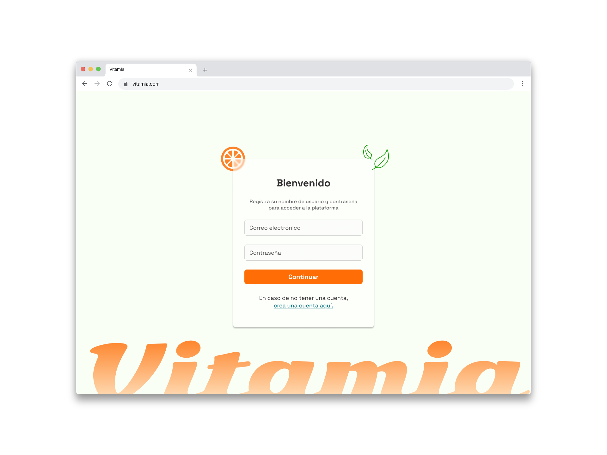
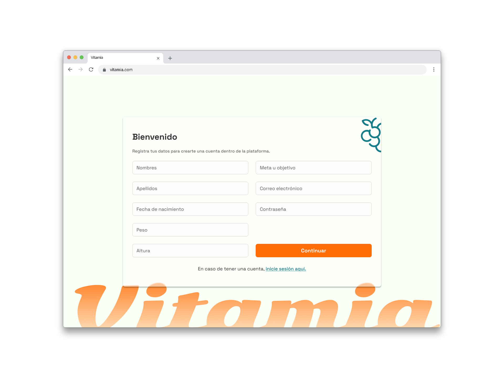
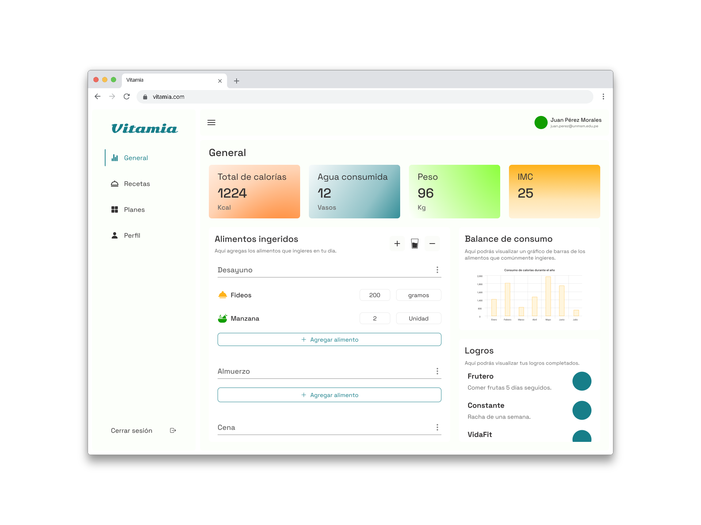

# Vitamia

Es un proyecto desarrollado por estudiantes de la FISI de la UNMSM para el curso de Experiencia de Usuario y Usabilidad.
El proyecto consiste en desarrollar una aplicación que permite mejorar los hábitos alimenticios.

Estudiantes:

- Coronado Cortez, Jeferson
- Pardave Jara, Asthri
- Patricio Julca, Vilberto
- Velarde Huancahuari, Bryan

## Prototipo

### Pantalla de Inicio de Sesión

### Pantalla de Registro

### Dashboard

